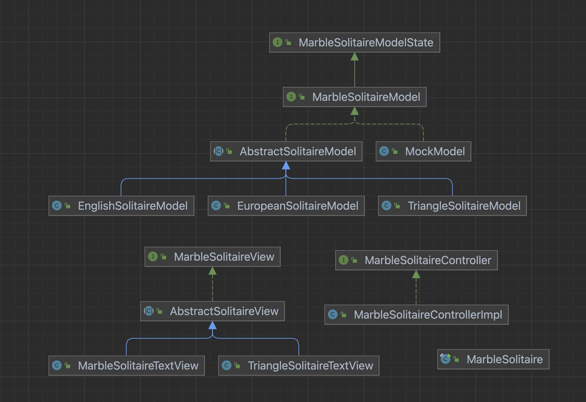

# Marble Solitaire
### Created for: CS3500 Object-Oriented Design
### Created by: Cole Harvey

---

The following document is intended to give a quick overview of the interfaces, classes, and methods
within my Marble Solitaire Game.

---

## Class Diagram

---

## Model
### Interface: MarbleSolitaireModel

The `MarbleSolitaireModel` interface represents the operations offered by the marble solitaire model.
Moves are carried out in the MarbleSolitaireModel implementation.

### Interface: MarbleSolitaireModelState

The `MarbleSolitaireModelState` interface represents operations that can be used to monitor the
state of a marble solitaire model, without changing it.

## SimpleModel
### Implementation: EnglishSolitaireModel

The `EnglishSolitaireModel` class implements `MarbleSolitaireModelState` and `MarbleSolitaireModel` interfaces.
One object represents a game of English Solitaire. The parameters can be specified by the user.

## BetterModel
### Implementation: AbstractSolitaireModel

The `AbstractSolitaireModel` class implements `MarbleSolitaireModelState` and `MarbleSolitaireModel`. The
abstract class contains similar methods used in each type of game to reduce code duplication.

### Implementation: EuropeanSolitaireModel

The `EuropeanMarbleSolitaire` class implements `MarbleSolitaireModelState` and `MarbleSolitaireModel` interfaces.
One object represents a game of European Solitaire. The parameters can be specified by the user.

### Implementation: TriangleSolitaireModel

The `TriangleSolitaireModel` class implements `MarbleSolitaireModelState` and `MarbleSolitaireModel` interfaces.
One object represents a game of Triangle Solitaire. The parameters can be specified by the user.

---

## View
### Interface: MarbleSolitaireView
The `MarbleSolitaireView` interface represents the operations that are used to create a visual game
for the user. The view is output to console.

### Implementation: AbstractSolitaireView
The `AbstractSolitaireView` class implements `MarbleSolitaireView` and contains methods that each of
the unique game view classes would have. This class centralizes some methods and reduces code duplication.

### Implementation: MarbleSolitaireTextView
The `MarbleSolitarireTextView` class implements `MarbleSolitaireView` and contains methods that create a 
visual aspect to the European and English Marble Solitaire game modes.

### Implementation: TriangleSolitaireTextView
The `TriangleSolitaireTextView` class implements `MarbleSolitaireView` and contains methods that create a
visual aspect to the Triangle Marble Solitaire game mode.

---

## Controller
### Interface: MarbleSolitaireController
The `MarbleSolitaireController` interface represents the operations that allow the user to make moves and 
play the game.

### Implementation: MarbleSolitaireControllerImpl
The `MarbleSolitaireControllerImpl` class implements `MarbleSolitaireController` and contains methods take in
the user input from console and determines if the input is a valid move.

---

## The Game